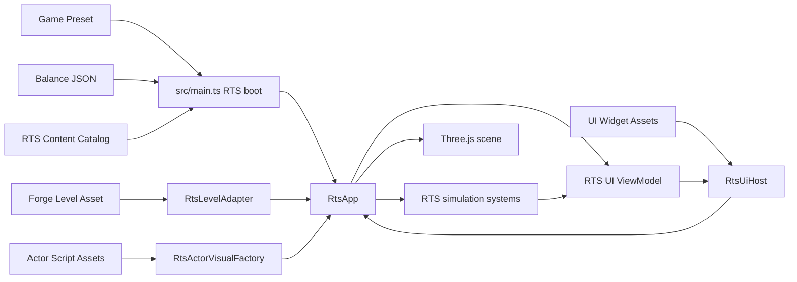

# ThreeAges RTS Content Drawer Assetlestirme Plani

Olusturulma tarihi: 2026-07-17  
Durum: Faz C tamamlandi (2026-07-22; manual Content Drawer -> runtime kabul
teyitli). Aktif uygulama adimi: Faz D - Level gameplay marker'lari.
Kapsam: `RtsApp` ile Forge Actor Script, oyun verisi, Level ve UI Widget
sistemleri arasinda veri/authoring koprusu kurulmasi

## 1. Amac

ThreeAges RTS'nin hizli prototip asamasinda TypeScript icinde kurulan sahne,
birim, yapi ve UI sunumunu; oynanis kurallarini kaybetmeden Forge'un Content
Drawer ve Level Editor authoring akisina tasimak.

Bu planin sonunda hedeflenen calisma bicimi:

- Tasarimci Landscape, dekorasyon, isik, baslangic noktalari, kaynak dugumleri
  ve AI rota/anchor verisini Level Editor'da kurabilir.
- Birim ve yapilarin mesh, collider, ses, VFX ve varsayilan sunum bilesenleri
  Actor Script asset'lerinde duzenlenebilir.
- Maliyet, can, hasar, uretim suresi, nufus ve AI esikleri balance/preset
  verisinde kalir.
- HUD ve ekran yerlesimleri UI Widget asset'lerinden gelir; UI eylemlerinin
  anlami ve simulasyon mutasyonlari TypeScript'te kalir.
- `RtsApp`, bu kaynaklari birlestiren ince bir composition root olur; tek tek
  model yollarini, harita koordinatlarini ve DOM agaclarini sahiplenmez.

## 2. Mevcut Durum ve Temel Bosluk

Forge tarafinda gerekli temel sistemler vardir:

- Content Drawer; Actor Script, UI Widget, Blackboard, Behavior Tree, AI Query
  ve State Tree asset'i olusturabilir.
- `*.actor.json` siniflari editor ve standart runtime tarafindan yuklenebilir.
- `RoomLayout`, Landscape, static instance, isik, Actor Script instance,
  AI Navigation Volume, Target Point ve Spline verisini tasir.
- `RuntimeUiSubsystem` ve `UiViewModelStore`, `*.ui.json` dosyalarini render edip
  veri binding'i ve message action saglar.
- `public/game-data` altindaki balance/preset verileri tipli ve dogrulanmis
  olarak yuklenir.

ThreeAges RTS ise su anda bu hatlarin yaninda ayri bir runtime olarak calisir:

- `src/main.ts`, `?rts` rotasinda `RtsApp`i dogrudan baslatir.
- `RtsApp`, `RuntimeSceneApp` kullanmaz ve `TestLevel.level.json` dosyasini
  yuklemez.
- `RTS_BLOCKOUT_MAP`, baslangic noktalarini, kaynak dugumlerini, AI build
  anchor'larini, road route'larini ve nav blocker'larini TypeScript'te tutar.
- `RtsMapArt` ve `RtsBuildingVisuals`, glTF yollarini kod icinde esler.
- `Unit`, rol bazli placeholder geometry'yi kendi constructor'inda olusturur.
- RTS HUD, build palette, selection panel, notification feed ve sonuc ekrani
  ozel DOM siniflaridir.

Sonuc olarak Content Drawer'da uretilen yeni bir RTS Actor veya UI asset'i,
`RtsApp` tarafinda acik bir tuketim noktasi olmadikca oynanisa etki etmez.
Eksik parca yeni bir editor degil, bu iki taraf arasindaki entegrasyon
sozlesmesidir.

## 3. Kilit Mimari Kararlar

### K-01 - RtsApp korunacak

`RtsApp`, ilk assetlestirme calismasinda `RuntimeSceneApp`e cevrilmeyecek ve
RTS simulasyonu generic scene runtime icine tasinmayacak.

Gerekce:

- Secim, komut, ekonomi, lojistik, savas ve stratejik AI halihazirda `RtsApp`
  etrafinda calisiyor.
- Tam runtime degisimi, authoring hedefinden daha buyuk bir yeniden tasarim
  yaratir.
- Dogru ilk adim, `RtsApp`e dar loader/factory/adapter portlari vermektir.

### K-02 - Actor Script oynanis otoritesi degil, archetype/sunum asset'idir

Actor Script su bilgileri tasiyabilir:

- Static veya skeletal mesh bilesenleri,
- collider ve secim/presentation bounds bilgisi,
- animasyon, Audio, ParticleEmitter ve Light bilesenleri,
- world-space UI referansi,
- editor preview hiyerarsisi,
- sinif seviyesi varsayilan authoring degiskenleri.

Actor Script su bilgilerin otoritesi olmayacak:

- can, hasar, zirh sinifi ve saldiri araligi,
- hareket hizi ve pathfinding algoritmasi,
- maliyet, uretim/insaat suresi ve nufus,
- ekonomi, territory ve lojistik kurallari,
- stratejik AI karar algoritmasi,
- canli mac state'i.

Bu ayrim ayni degerin hem Actor Script hem balance JSON'da farkli kalmasini
engeller.

### K-03 - Balance verisi tek oynanis otoritesidir

Mevcut `units.json`, `buildings.json`, `resources.json`, `ages.json`,
`roads.json` ve `ai.json` oynanis sayilarinin otoritesi olarak kalacak.

Balance dosyalarina mesh yolu, UI asset id'si, CSS veya Level koordinati
eklenmeyecek.

### K-04 - Balance ile Content asset arasinda ayri katalog olacak

Balance kimliklerini Actor/UI asset'lerine baglamak icin
`public/game-data/content/rts-content.json` adinda dogrulanan bir
`RtsContentCatalog` eklenecek.

Ornek hedef sozlesme:

```json
{
  "schema": 1,
  "type": "rtsContentCatalog",
  "units": {
    "guard_placeholder": {
      "actorRef": "assets/ThreeAges/Actors/Units/BP_RTS_Guard.actor.json"
    },
    "worker_placeholder": {
      "actorRef": "assets/ThreeAges/Actors/Units/BP_RTS_Worker.actor.json"
    }
  },
  "buildings": {
    "barracks": {
      "constructionActorRef": "assets/ThreeAges/Actors/Buildings/BP_RTS_Barracks_Construction.actor.json",
      "levels": {
        "1": "assets/ThreeAges/Actors/Buildings/BP_RTS_Barracks_T1.actor.json",
        "2": "assets/ThreeAges/Actors/Buildings/BP_RTS_Barracks_T2.actor.json"
      }
    }
  },
  "ui": {
    "hud": "threeages-rts-hud",
    "matchResult": "threeages-rts-match-result"
  }
}
```

Kurallar:

- Actor referanslari, Forge `LayoutActorInstance.classRef` ile ayni bicimde
  public-root-relative `*.actor.json` yoludur.
- UI referanslari manifest asset id'sidir; `RuntimeUiSubsystem` mevcut id
  resolver sozlesmesini kullanir.
- Her katalog referansi boot sirasinda dogrulanir.
- Bir balance id'si katalogda yoksa gecis doneminde placeholder fallback
  kullanilabilir; release gate'te eksik mapping hata olur.
- Katalog oynanis degeri tasimaz.

### K-05 - Level mekansal otoritedir

Level asset'i su bilgilerin tek otoritesi olacak:

- Landscape ve paint verisi,
- static dekorasyon, isik, atmosfer ve post process,
- oyuncu/dusman baslangic noktalari,
- kaynak dugumlerinin konumlari,
- AI build anchor ve expansion region konumlari,
- authored road-route spline'lari,
- navigation volume ve statik blocker geometrisi,
- sunum landmark'lari ve dunya sesleri.

Level su bilgileri tasimayacak:

- birim/yapi balance sayilari,
- baslangic kaynak miktarlari,
- AI intent agirliklari,
- HUD yerlesimi,
- mac icinde sonradan uretilen unit/building instance'lari.

Baslangic kaynaklari, baslangic roster'i, AI profili ve hangi Level'in
acilacagi scenario/preset verisinin sorumlulugudur. Mevcut `mapState` alani
geriye uyumlu bicimde `levelRef` sozlesmesine gecirilecektir.

### K-06 - UI Widget gorunum; TypeScript davranis otoritesidir

UI Widget sunlari tasir:

- widget agaci ve responsive yerlesim,
- metin/gorsel/progress binding yolları,
- tema, lokalizasyon ve accessibility verisi,
- butonlarin message action adlari.

TypeScript sunlari tasir:

- ViewModel alanlarini uretme,
- `rts.build.begin:*`, `rts.train:*`, `rts.restart` gibi mesajlari dogrulama,
- maliyet, uygunluk ve mac state'i kontrolleri,
- simulasyon mutasyonlari,
- bildirim uretme ve cooldown kurallari.

## 4. Sahiplik Matrisi

| Veri/davranis | Actor Script | Balance/preset | Level | UI Widget | TypeScript runtime |
|---|---:|---:|---:|---:|---:|
| Unit mesh/animasyon/ses/VFX | Otorite | - | - | - | Yukler ve oynatir |
| Unit can/hasar/hiz/maliyet | - | Otorite | - | Gosterir | Uygular |
| Building mesh/tier gorunumu | Otorite | - | - | - | Duruma gore secer |
| Footprint/insaat/territory sayilari | Preview kontrolu | Otorite | - | Gosterir | Uygular |
| Landscape/dekor/ambient dunya | - | - | Otorite | - | Yukler |
| Start/resource/AI anchor konumu | Marker sinifi | Scenario kimligi | Otorite | - | Adapter ile okur |
| Baslangic roster ve kaynak | - | Preset otoritesi | Spawn noktasi | Gosterir | Spawn eder |
| HUD yerlesimi | - | - | UI asset ref secimi olabilir | Otorite | Mount eder |
| UI degerleri ve eylemleri | - | Kaynak degerler | - | Binding/action | Presenter/controller |
| Pathfinding algoritmasi | - | Agent sayilari olabilir | Bounds/blocker | Debug gosterimi | Otorite |
| Stratejik AI algoritmasi | Opsiyonel profil ref | Esik/agirlik | Anchor/route | Debug gosterimi | Otorite |
| Canli unit/building instance'i | Class tanimi | Stats tanimi | Baslangic fixture disinda yok | Gosterir | Otorite |

## 5. Hedef Entegrasyon Akisi



`RtsAppOptions` zamanla ham balance listesine ek olarak su portlari alacak:

```ts
interface RtsAppDependencies {
  content: RtsContentCatalog;
  level: RtsLevelDefinition;
  visuals: RtsActorVisualFactory;
  ui: RtsUiHost;
}
```

Bu portlar concrete DOM, fetch ve manifest bilgisini simulasyon sistemlerine
sokmaz.

## 6. Actor Script Entegrasyon Tasarimi

### 6.1 Unit sunum handle'i

`Unit` constructor'i placeholder mesh olusturmak yerine bir sunum handle'i
alabilecek hale gelecek:

```ts
interface RtsPresentationHandle {
  root: Object3D;
  pickTargets: Object3D[];
  selectionRadius: number;
  update?(dt: number): void;
  dispose(): void;
}
```

Bu degisimle:

- `UnitSystem`, `children[0]` varsayimiyla raycast yapmaz.
- Actor Script birden fazla mesh veya child kullanabilir.
- Animasyon mixer'i ve paylasilan asset lifecycle'i factory tarafinda kalir.
- Secim ring'i, health bar ve takim rengi gameplay presentation katmaninda
  kalabilir; Actor asset her takim icin kopyalanmaz.

Ilk unit pilotu `guard_placeholder` olacak. Worker/Archer/Siege ancak pilot
dogrulandiktan sonra tasinacak.

### 6.2 Building sunum handle'i

Mevcut `RtsBuildingVisuals` icindeki hard-coded `VISUALS` tablosu,
`RtsContentCatalog` + `RtsActorVisualFactory` ile degistirilecek.

- `PlacedStructure.stats.id` ve `structure.level`, katalog lookup anahtaridir.
- Insaat foundation/progress mantigi kodda kalir.
- Tamamlanan veya tier degistiren yapi icin ilgili Actor visual'i mount edilir.
- Gameplay nav blocker'i her zaman balance footprint'ten uretilir.
- Actor Collider, editor preview ve ileride fizik icin kullanilir; RTS placement
  ve nav otoritesini ele gecirmez.

Ilk building pilotu `barracks` T1/T2 olacak.

### 6.3 Generic Forge ihtiyaci: Actor instance variable override

`ActorScriptDef.variables` sinif default'larini tasiyor; ancak
`LayoutActorInstance` bugun instance override tasimiyor. Level icinde ayni
marker sinifini farkli `owner`, `resourceId`, `regionId` veya `buildingId` ile
kullanmak icin generic bir Forge gelistirmesi gereklidir:

```ts
interface LayoutActorInstance {
  // mevcut alanlar...
  variableOverrides?: Record<string, MetadataValue>;
}
```

Bu gelistirme birlikte tamamlanmali:

- `engine/scene/layout.ts` semasi,
- class default + instance override birlestiren saf helper,
- `actorInstanceToEntity` runtime aktarimi,
- Scene Details icinde class variable alanlari,
- `tools/saveValidator.ts` allowlist/normalizasyonu,
- editor save/load round-trip testleri,
- hedefli Playwright authoring smoke.

Bu ozellik Forge'a generic eklenir; engine veya editor koduna `rts`,
`buildingId` ya da `resourceId` gibi oyun-spesifik sabitler yazilmaz.

## 7. Level Entegrasyon Tasarimi

### 7.1 RtsLevelAdapter

Yeni `RtsLevelAdapter`, Forge `RoomLayout` + resolve edilmis Actor Script
siniflarini saf bir `RtsLevelDefinition`a cevirir:

```ts
interface RtsLevelDefinition {
  playerStart: RtsMapPoint;
  enemyStart: RtsMapPoint;
  resourceNodes: RtsResourceNodeDefinition[];
  buildAnchors: RtsBuildAnchor[];
  expansions: RtsExpansionRegion[];
  routes: RtsAuthoredRoute[];
  navigationBlockers: NavBlocker[];
}
```

Level'da kullanilacak ilk marker Actor Script'leri:

- `BP_RTS_KingdomStart.actor.json`
  - `owner`: `player | enemy`
- `BP_RTS_ResourceNode.actor.json`
  - `nodeId`, `resourceId`, `kind`
- `BP_RTS_BuildAnchor.actor.json`
  - `owner`, `buildingId`, `regionId`, `priority`
- `BP_RTS_ExpansionMarker.actor.json`
  - `regionId`, `role`: `outpost | depot | production`

Road ve expansion route'lari, nokta listelerini Actor variable'a gommek yerine
Forge Spline actor'lariyla author edilir. `LayoutSplineActor.runtime.tags`
uzerinde isimlendirilmis tag'ler kullanilir:

```text
rts.route:enemy:base:0
rts.route:enemy:enemy_west:0
rts.route:enemy:enemy_west:1
```

Adapter su hatalari boot'u durduran validation hatasi yapar:

- oyuncu veya dusman start'inin eksik/tekrarli olmasi,
- tekrarli resource node id'si,
- bilinmeyen balance `buildingId`/`resourceId`,
- eksik expansion member'i,
- ikiden az noktali route,
- world bounds disinda gameplay marker'i,
- start veya zorunlu rota icin ulasilamazlik.

### 7.2 Authored dunya render'i

`RtsApp`, Level'in Landscape/static instance/light/atmosphere verisini yeniden
yorumlayan ikinci bir renderer yazmayacak. `RuntimeSceneApp` ve `SceneApp`
icindeki ortak yukleme davranisi dar bir generic host'a ayrilacak:

```ts
interface AuthoredWorldHandle {
  root: Group;
  navigationBlockers: NavBlocker[];
  dispose(): void;
}
```

Onerilen generic sinir:

- manifest/model/material/landscape yukleme Forge scene katmaninda,
- RTS marker yorumlama `src/game/rts/world` altinda,
- RTS kamera ve simulasyon `RtsApp`te,
- Level Editor ve production runtime ayni authored dunya verisini tuketir.

`RtsMapArt` ancak Level asset'i tam karsilik saglayana kadar fallback olarak
kalir; yeni Level entegrasyonuna paralel ikinci bir kalici harita sistemi olmaz.

### 7.3 Landscape siniri

Mevcut RTS hareketi X/Z duzleminde ve `y = 0` varsayimiyla calisir. Bu nedenle
ilk Level migration'inda:

- oynanabilir alan duz veya cok dusuk egimli tutulur,
- dekoratif yukseklikler nav blocker veya oynanamaz alan olur,
- Landscape goruntusunun gelmesi terrain-aware RTS navigation'in tamamlandigi
  anlamina gelmez.

Yukseklik farkli yollarda oynanis istenecekse ayri bir fazda:

- landscape height sampling,
- unit Y projection,
- slope/step profili,
- cok katmanli veya heightfield nav,
- projectile ve selection raycast uyumu

birlikte ele alinmalidir.

## 8. UI Widget Entegrasyon Tasarimi

### 8.1 RtsUiHost

`RtsUiHost`, Forge `RuntimeUiSubsystem` ve `UiViewModelStore`u sarar. `RtsApp`
DOM sinifi kurmak yerine host'a snapshot ve action handler verir.

Ilk ViewModel sozlesmesi:

```text
rts.resources.food
rts.resources.wood
rts.resources.stone
rts.resources.gold
rts.population.label
rts.age.label
rts.selection.title
rts.selection.details
rts.match.result
```

Ilk message action sozlesmesi:

```text
rts.restart
rts.age.upgrade
rts.build.begin:house
rts.build.begin:barracks
rts.train:guard_placeholder
```

Message parse ve allowlist TypeScript'te kalir. UI dosyasindan gelen serbest bir
string dogrudan ekonomi veya spawn servisini cagiramaz.

### 8.2 Asamali UI migration'i

Forge UI Widget sistemi bugun `text`, `value`, `max` ve `src` binding'lerini
destekliyor. Bu nedenle migration tek seferde yapilmayacak.

1. **Salt-okunur HUD pilotu**
   - kaynaklar, nufus, cag ve secim basligi,
   - mevcut binding sistemi yeterli,
   - mevcut RTS HUD feature flag/fallback olarak korunur.
2. **Mac sonucu ve restart**
   - UI screen stack + message action kullanilir.
3. **Selection panel ve build palette**
   - once Forge UI'a `visible` ve `disabled/enabled` binding'i eklenir,
   - buton uygunlugu gameplay snapshot'indan gelir.
4. **Production queue ve notification feed**
   - dinamik satirlar icin generic List/Repeater widget veya collection binding
     gerekir,
   - bu yetenek gelmeden bildirimler sabit sayida node'a veya DOM hack'ine
     zorlanmaz,
   - mevcut ozel UI siniflari gecici olarak kalir.

Aktif HUD calismasi tamamlanip kendi testleriyle baseline olmadan bu plan onun
dosyalarini degistirmeyecek veya geri almayacak.

## 9. Uygulama Fazlari

### Faz A - Baseline ve sozlesme kilidi

Teslimatlar:

- Mevcut `?rts` davranisinin hedefli smoke baseline'i.
- Balance id, hard-coded model yolu, map sabiti ve UI yuzeyi envanteri.
- `RtsContentCatalog` semasi ve kararlarinin `TECH_DECISIONS.md`ye eklenmesi.
- Asset migration feature flag'i: varsayilan kapali.

Kabul:

- Kod davranisi degismez.
- Mevcut calisma agacindaki HUD/AI calismasi korunur.
- Legacy ve asset yolu arasinda hangi gate'te gecis yapilacagi yazilidir.

#### Faz A - Durum (2026-07-19)

Tamamlandi. Ilk kapanis sirasinda `npx tsc --noEmit`, `npm run test:engine`
(1065 check), `npm run build:verify` ve `check:assets` yesildi. 2026-07-22
kapanisinda karar kaydi ve migration'a ozel browser baseline eklendi;
`npx.cmd tsc --noEmit`, `npm.cmd run test:engine`,
`npm.cmd run smoke:browser -- tests/smoke/rts-assetization-baseline.spec.ts`
(1 Chromium testi) ve `npm.cmd run build:verify` yeniden yesil.

Yapilanlar:

- `contentAssets` migration feature flag'i eklendi (varsayilan kapali,
  `?flags=contentAssets` ile acilir): `src/game/core/featureFlags.ts`. Flag
  kapaliyken RTS gorselleri legacy kod-tarafi tablolardan cozulur
  (`rtsBuildingArt` / `rtsMapArt` / `Unit` placeholder geometry); flag asset
  yolunu secer. Hicbir shipped preset onu acmaz.
- Baseline sozlesme testleri eklendi (`tools/engine-tests.ts`, "Assetization
  Faz A" ile aranir): (1) flag varsayilan kapali ve hicbir preset acmaz; (2)
  legacy gorsel otoriteler kilitlendi - `rtsBuildingArt` tum balance yapilarini
  kapsar, hicbir unit id'si oradan cozulmez (Faz C'nin kapatacagi bosluk); (3)
  `RTS_BLOCKOUT_MAP` hala mekansal otorite ve resource node id'leri tekil (Faz
  D adapter'inin ilk reddedecegi durum). Envanter prosa bir liste yerine bu
  testlerde kilitlendi.
- Kod davranisi degismedi; kullanicinin acik HUD/UI calismasina dokunulmadi.

Faz A kapanis teslimatlari (2026-07-22):

- `RtsContentCatalog` semasi ve K-01..K-06 kararlar `GDD/TECH_DECISIONS.md`
  dosyasinda TD-006..TD-011 olarak kilitlendi.
- `tests/smoke/rts-assetization-baseline.spec.ts`, varsayilan `?rts&debug`
  boot/start akisini ve `contentAssets` flag'inin default olarak kapali oldugunu
  browser katmaninda kayda alir. Mevcut kapsamli `rts-*.spec.ts` testleri bu
  dar baseline'in yerini degil, tamamlayici kabul coverage'ini saglar.

Plan disi ama dogrudan ilgili yan is (ayni oturumda yapildi):

- Faz oncesi CI kirmiziydi: uc ayri denge pass'i (`584ec86`, `98b244e`,
  `63574e5`) tuning sayisini cividileyen testleri bozmus, ayrica `core_match`
  preset'i test amacli 5000 kaynakla kalmisti. Ilgili testler §75 dogrultusunda
  deger cividilamak yerine invariant dogrulayacak sekilde yeniden yazildi, preset
  500/500/0/0'a donduruldu. Sonuc: denge ayari artik CI'i kirmaz; yalnizca bir
  *kurali* bozan degisiklik kirar. Bu, asagidaki editor cilasinin on kosuluydu.
- Balance verisini oyun ici gormeden ayarlamak icin generic bir Data Table
  editoru eklendi (Forge `?editor` -> ust bardaki "Veri" menusu). K-03'un
  "balance tek oynanis otoritesi" ilkesine bir authoring yuzeyi getirir; asset
  migration'i degil, gunluk denge ayarini hedefler. Ozellikler: units, buildings,
  resources, ages, ai, roads tablolari; girdi-basina form; alan-basina
  "Varsayilana don" (git HEAD'den geri yukler); Turkce etiket + min/max/step;
  yapisal alanlar (tier `level`, cag `id`) readonly; validate-on-save (gercek
  runtime validator, editor `@/game` import etmez - `GameEditorCatalog` uzerinden
  enjekte). Dosyalar: `src/editor/DataTableEditor.ts`,
  `src/editor/dataTableStore.ts`, `src/editor/gameEditorRegistry.ts`,
  `src/game/editorCatalog.ts`, `src/editor/EditorUi.ts` ("Veri" menusu),
  `tools/saveValidator.ts` (`validateSaveGameDataPayload` / `validateGameDataPath`),
  `vite.config.ts` (`/__save-gamedata`, `/__gamedata-defaults`),
  `tests/smoke/data-table-editor.spec.ts`.
- Not (veri modeli kokusu): outpost gibi progression'li yapilarda seviye-1
  territory iki yerde duruyor (top-level `territory` + `progression.settlement[0]
  .territory`) ve elle senkron tutulmasi gerekiyor; bir engine testi sapmayi
  yakalar. Editorde top-level alanlara aciklayici hint kondu. Ileride tek
  otoriteye indirmek (loader turetsin) ayri bir is olarak durabilir.

### Faz B - Content catalog ve loader

#### Faz B - Durum (2026-07-22)

Tamamlandi. `public/game-data/content/rts-content.json` yalnizca referans
sozlesmesini tasiyan bir shipped catalog olarak eklendi. Guard/Barracks
mapping'leri Faz C tarafindan doldurulur; flag kapaliyken default runtime legacy
gorsel yolunu kullanmaya devam eder.

- `src/game/rts/content/rtsContentCatalog.ts`: schema/type, strict Actor ref,
  UI asset-id ve balance-id validator'i.
- `src/game/rts/content/rtsContentLoader.ts`: `contentAssets` flag'i acikken
  katalog fetch + validation'i.
- `src/main.ts`: sadece opt-in flag acikken catalog yukler ve `RtsAppOptions`
  uzerinden enjekte eder; catalog veya asset pack yuklenemezse legacy visual
  path secilmeye devam eder.
- `tools/engine-tests.ts`: shipped catalog, bilinen balance ID, level anahtari
  ve Actor ref reddetme/acceptance coverage'i.
- `tests/smoke/rts-assetization-baseline.spec.ts`: default legacy boot ile
  `?flags=contentAssets` catalog boot'u birlikte geciyor (2 Chromium test).

Kapanis gate'i: `npx.cmd tsc --noEmit`, `npm.cmd run test:engine`, hedefli
Playwright smoke ve `npm.cmd run build:verify` yesil.

Teslimatlar:

- `public/game-data/content/rts-content.json`
- `src/game/rts/content/rtsContentCatalog.ts`
- `src/game/rts/content/rtsContentLoader.ts`
- schema/ref/balance-id validator testleri
- `src/main.ts` boot'ta katalog yukleme ve `RtsAppOptions` enjeksiyonu

Kabul:

- Katalog kapali flag ile mevcut runtime'i degistirmez.
- Eksik/kirik ref acik hata veya belgeli fallback uretir.
- Balance dosyalarina asset yolu eklenmez.

### Faz C - Guard + Barracks Actor Script pilotu

#### Faz C - Durum (2026-07-22)

Uygulama ve otomatik kapanis tamamlandi. Guard ile Barracks'in insaat, T1 ve T2 gorunumleri Actor Script
asset'leri olarak `public/assets/ThreeAges/Actors/` altinda author edilir ve
manifestte Content Drawer'a kayitlidir. `RtsActorVisualFactory`, catalog
referanslarini Actor component agacina ve glTF sunum handle'ina cevirir;
`UnitSystem` artik Actor'un acik pick-target'larini kaydeder. `RtsApp` asset
pack yuklenirse sunumlari yeniler, yuklenemezse legacy gorsellere geri duser.
Unit ve bina simulasyon degerleri balance dosyalarinda kalir.

- `?rts&flags=contentAssets` browser smoke'u asset pack'in `ready` durumuna
  ulastigini ve match boot'un korundugunu dogrular.
- Engine testleri katalog tier secimini, Actor component/mesh referanslarini ve
  nested pick target -> unit cozumunu kilitler.
- Content Drawer'da `BP_RTS_Guard.actor.json` cift tiklanarak mevcut Actor
  Script editorunde acilir; kaydetme mevcut `/__save-actor` authoring akisini
  kullanir. Gercek bir mesh degisikligiyle editor -> runtime kabul adimi
  etkilesimli/manual smoke ile teyit edildi (2026-07-22).

Teslimatlar:

- Guard Actor Script asset'i.
- Barracks construction, T1 ve T2 Actor Script asset'leri.
- `RtsActorVisualFactory` ve presentation handle sozlesmesi.
- `UnitSystem` pick target refactor'u.
- `RtsBuildingVisuals` katalog adapter'i.
- Content Drawer open/edit/save ve runtime smoke.

Kabul:

- Guard mesh/visual bileseni Content Drawer'dan degistirildiginde TypeScript
  degismeden `?rts`te gorulur.
- Barracks T1 -> T2 gecisi dogru Actor asset'ini kullanir.
- Unit ve building oynanis sayilari balance'tan gelmeye devam eder.
- Eksik asset, tanimli placeholder ile oynanabilir runtime'i korur.

### Faz D - Level gameplay marker'lari

#### Faz D - Durum (2026-07-22)

Devam ediyor. Generic Forge `LayoutActorInstance.variableOverrides` zinciri
tamamlandi: layout semasi, save allowlist/normalizasyonu, class default +
type-safe instance override birlestirme helper'i ve `ScriptActor` runtime
aktarimi birlikte calisiyor. Bilinmeyen veya Actor variable tipiyle uyusmayan
override runtime'a sizmaz. Engine testleri default/override birlesimini ve
layout round-trip'ini kapsar.

Marker bootstrap dilimi tamamlandi: `RTS_CoreMatch.level.json`, iki Kingdom
Start, bir Resource Node, bir Build Anchor ve `rts.route:enemy:base:0` spline
ornegini tasir. Asset manifestte `rts-core-match-level` olarak gorunur;
`rtsLevelLoader.ts` Level ve onun Actor class referanslarini browser tarafinda
yukleyip adapter'a verir. Shipped Level + gercek Actor class referanslari engine
testinde birlikte cozulur.

Bu Level henuz mevcut macin tum spatial contract'ini tasimadigindan
`RtsApp`/preset `levelRef` ile ona yonlendirilmemistir. Siradaki Faz D dilimi,
`RTS_BLOCKOUT_MAP`in kaynak, anchor/expansion, route, tree, strategic point ve
navigation blocker verisini eksiksiz marker/Level sozlesmesine tasimak ve ancak
sonra legacy spatial otoriteyi opt-in runtime baglantisiyla degistirmektir.

`src/game/rts/world/rtsLevelAdapter.ts` baslatildi: resolve edilmis Actor
default/override'larindan Kingdom Start, Resource Node ve Build Anchor
markerlarini; `rts.route:*` spline tag'lerinden de route noktalarini saf bir
`RtsLevelDefinition`a cevirir. Shipped marker assetleri ve browser-side loader
eklendi; tam spatial contract ile `RtsApp` baglantisi sonraki dilimdedir.

`BP_RTS_KingdomStart`, `BP_RTS_ResourceNode` ve `BP_RTS_BuildAnchor` marker
Actor class'lari `public/assets/ThreeAges/Actors/Markers/` altinda ve manifestte
yer alir. Adapter'in start/resource/anchor/spline route basari ve hata
sozlesmesi engine testiyle kilitlenmistir.

Teslimatlar:

- Generic Actor instance variable override destegi.
- RTS marker Actor Script asset'leri.
- `RtsLevelAdapter`, browser-side Level loader'i ve pure/shipped-asset validation
  testleri.
- Preset `levelRef` validation migration'i.
- Bootstrap start, resource, anchor ve route verisinin yeni Level'e tasinmasi.
- Tam spatial contract migration'i ve `RtsApp` opt-in baglantisi (bekliyor).

Kabul:

- Bir resource node veya AI anchor Editor'da tasindiginda `rtsMapBlockout.ts`
  degistirilmeden runtime davranisi degisir.
- Iki flank ve zorunlu route ulasilabilirlik testleri Level verisiyle gecer.
- `RTS_BLOCKOUT_MAP` bu alanlarda otorite olmaktan cikar.

### Faz E - Landscape ve authored dunya

Teslimatlar:

- Generic authored-world loader/handle extraction'i.
- RTS Level'in Landscape, static instance, light, atmosphere ve collision
  verisinin `RtsApp` scene'ine mount edilmesi.
- `RtsMapArt` fallback gate'i.
- Editor -> save -> `?rts` browser smoke.

Kabul:

- Landscape/dekor/isik degisikligi kod degistirmeden runtime'a gelir.
- Editor ve RTS runtime ayni Level asset'ini gorur.
- Authored world dispose/restart sonrasi GPU/DOM kaynak sizintisi birakmaz.
- Duz zemin navigasyon kabul senaryosu bozulmaz.

### Faz F - UI Widget pilotu ve kademeli migration

Teslimatlar:

- `RtsUiHost` ve ViewModel presenter.
- `WBP_RTS_HUD.ui.json`.
- `WBP_RTS_MatchResult.ui.json`.
- message allowlist ve action testleri.
- gerekli `visible/disabled` binding generic uzantisi.

Kabul:

- Kaynak, nufus ve cag UI'si `.ui.json` degisikligiyle yeniden duzenlenebilir.
- Restart mesaji ayni mac reset yolunu cagirir.
- UI asset'i simulasyon servisine dogrudan erismez.
- Mevcut responsive smoke cozumleri korunur.

### Faz G - Kapsam genisletme ve legacy kaldirma

Tum building Actor kapsami ile Guard/Isci UAL1 skeletal animasyon pilotunun
ayrintili, sirali plani `THREEAGES_RTS_ACTOR_COVERAGE_AND_ANIMATION_PLAN.md`
dosyasindadir. Faz G uygulanirken bu dokumandaki ownership sinirlari korunur.

Teslimatlar:

- Worker, Archer, Siege Actor Script'leri.
- Tum yapi/tier asset mapping'leri.
- Selection, build, production ve notification UI migration'i.
- hard-coded glTF tablolarinin ve tamamlanan fallback'lerin kaldirilmasi.
- `RtsApp` composition sorumluluklarinin dar loader/factory/controller'lara
  bolunmesi.

Kabul:

- Her unit/building balance id'sinin katalog mapping'i vardir.
- Normal `?rts` akisinda `RtsMapArt.VISUALS`, `RtsBuildingVisuals.VISUALS` veya
  rol placeholder geometry'si kullanilmaz.
- Level koordinatlari TypeScript'te kalmaz.
- UI'nin tamamlanan bolumlerinde elle DOM agaci kuran eski siniflar calismaz.

## 10. Onerilen Dosya Yerlesimi

```text
public/
  game-data/
    content/
      rts-content.json
  assets/ThreeAges/
    Actors/
      Units/
      Buildings/
      Markers/
    UI/
    Levels/
      RTS_CoreMatch.level.json

src/game/rts/
  content/
    rtsContentCatalog.ts
    rtsContentLoader.ts
    rtsActorVisualFactory.ts
  world/
    rtsLevelAdapter.ts
    rtsAuthoredWorld.ts
  ui/
    rtsUiHost.ts
    rtsUiPresenter.ts
    rtsUiMessages.ts
```

Generic Forge'a ait degisiklikler oyun klasorune kopyalanmayacak:

```text
engine/scene/          Actor variable resolution
engine/render-three/   generic Actor Object3D factory/handle
engine/ui/             visible/disabled ve collection binding
src/editor/            instance variable Details authoring
tools/saveValidator.ts layout/asset allowlist ve normalizasyon
```

## 11. Dogrulama Stratejisi

Her faz icin minimum gate:

1. `npx.cmd tsc --noEmit`
2. `npm.cmd run test:engine`
3. Degisen authoring/runtime yuzeyine hedefli Playwright smoke
4. `npm.cmd run build:verify`

Ek hedefli kontroller:

- Content catalog schema ve tum referanslar.
- Her balance id'sinin katalog coverage'i.
- Actor class default + instance override round-trip.
- Actor visual clone/dispose ve pick-target testi.
- Level marker duplicate/missing/ref validation'i.
- Iki flank ve AI route ulasilabilirligi.
- UI ViewModel binding ve message allowlist.
- Editor'da asset olustur, kaydet, yeniden ac.
- Editor'da marker/landscape tasiyip runtime'da ayni sonucu gor.
- Restart sonrasi duplicate DOM, scene child veya subscription kalmamasi.

Interaktif kabul satirlari yalniz otomatik testle kapatilmayacak. Actor asset
degisikligi, Level save/play akisi ve responsive HUD en az bir hedefli browser
smoke veya manuel kabul gerektirir.

## 12. Riskler ve Koruma Kurallari

### Cift otorite riski

Ayni deger Actor, balance ve Level'da tekrar edilmez. Ozellikle footprint,
health, cost ve speed balance otoritesinde kalir.

### Assetlestirme adina sistemleri data'ya gommek

Pathfinding, combat resolution, economy tick ve Kingdom AI algoritmalari JSON
veya Actor event binding'e tasinmaz. Data yalniz parametre ve authoring
referansidir.

### RtsAppi ikinci RuntimeSceneAppe cevirmek

Manifest, material, landscape ve Actor render kodu kopyalanmaz. Ortak davranis
generic Forge modulu olarak ayrilir.

### UI kabiliyetinden hizli migration

Liste/repeater veya enabled/visible binding yokken build palette ve notification
feed sahte sabit node'larla yeniden kurulmaz. Mevcut ozel UI gecici olarak
korunur.

### Save validator veri kaybi

Yeni `LayoutActorInstance.variableOverrides` veya baska Level alanlari,
`tools/saveValidator.ts` allowlist'ine ve round-trip testine ayni fazda
eklenmeden editor save acilmaz. Aksi halde alanlar sessizce dusebilir.

### Fork/upstream ayrimi

- ThreeAges Actor, Level, UI ve `src/game/rts` adapter'lari oyun reposuna aittir.
- Instance override, generic Actor visual factory ve UI binding uzantilari Forge
  platform yetenegidir.
- Generic degisikliklerde ThreeAges id veya kural sabiti kullanilmaz; uygun
  zamanda Forge upstream'e tasinabilecek sinirda tutulur.

Save/layout validator, asset ingestion ve UI message sinirlari degisecegi icin
ilgili uygulama fazlarindan sonra Codex Security `security-diff-scan` yapilmasi
onerilir. Scan kullanici onayi olmadan baslatilmaz.

## 13. Kaldirma Kapisi

Asagidaki kosullar tamamlanmadan mevcut kod tabanli fallback'ler silinmez:

- Tum unit ve building id'leri katalogda kapsanmis.
- Level gameplay marker'lari ve authored world runtime'da dogrulanmis.
- Asset eksigi durumunda gelistirme hatasi acik gorunuyor.
- Guard/Barracks pilotundan sonra en az bir tam mac browser smoke gecmis.
- UI migration edilen yuzeylerin responsive ve action testleri yesil.
- Restart/dispose kaynak temizligi kanitlanmis.
- `build:verify` yesil.

Fallback kaldirildiginda tek otorite kalmalidir; legacy kod yorum satiri veya
ikinci gizli yol olarak korunmaz.

## 14. Ilk Uygulama Dilimi

Ilk kodlama gorevi su kapsamla sinirlanmalidir:

> `RtsContentCatalog` semasini ve loader'ini ekle; Guard ile Barracks T1/T2 icin
> Actor Script asset'leri olustur; `RtsActorVisualFactory` uzerinden sadece bu
> iki turu opt-in feature flag ile yukle. Gameplay balance, Level ve mevcut UI
> davranisini degistirme. Eksik asset'te mevcut placeholder'a geri don. TypeScript,
> engine testleri, Actor Content Drawer smoke ve `build:verify` ile dogrula.

Bu dilim su soruya kanitli cevap vermelidir:

> Guard veya Barracks'in mesh/bilesen yapisini Content Drawer'dan
> degistirdigimizde `RtsApp.ts` duzenlemeden degisiklik oyunda goruluyor mu?

Bu kabul edilmeden toplu unit/building asset uretimine, Level schema
genisletmesine veya UI migration'ina gecilmemelidir.
