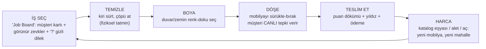
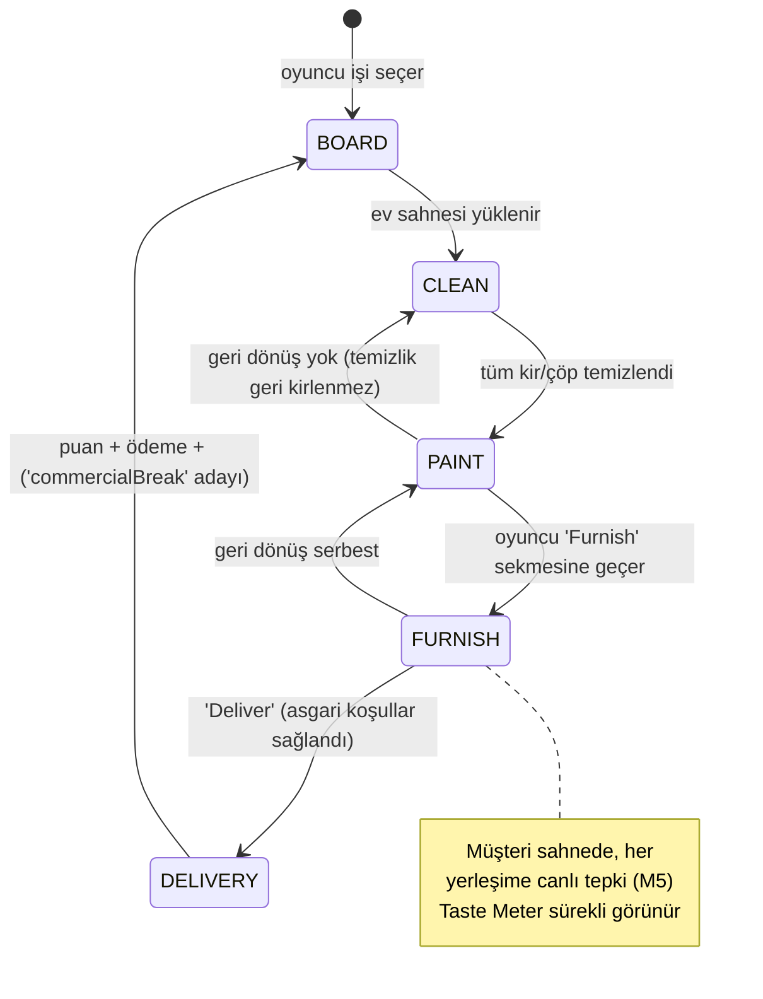
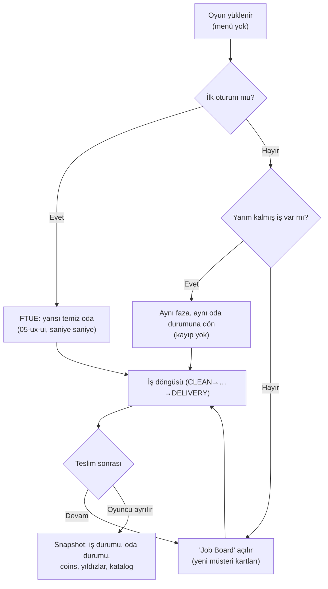

# Ev Ustası — 01 Core Loop

> Durum: taslak | Versiyon: 0.1 | Tarih: 2026-06-12 | Bağımlı: 00-overview.md, 02-mechanics.md, 03-economy.md

## 1. Çekirdek döngü

Döngünün motoru iki tatminin ardışıklığıdır: önce **temizliğin dokunsal hazzı** (sürt → anında silinir), sonra **beğenilmenin sosyal hazzı** (yerleştir → müşteri kalp atar). Harcama katmanı bu ikisini besler: daha iyi aletler temizliği hızlandırır, daha zengin katalog daha yüksek zevk uyumu (= daha çok yıldız/para) sağlar. Müşteri tepkisi anlık olduğu için oyuncu teslimden **önce** ne alacağını bilir — sürpriz cezası yok, bilgilendirilmiş tamamlama var (Lens #30 Fairness, #56 Transparency).

## 2. İş durum makinesi

Her iş (job) tek seferde şu durumlardan geçer; faz sekmeleri HUD'da görünür (05-ux-ui):

- **CLEAN:** Tek parmak sürtme = kir silme; tap = çöp atma. Faz, kir sayacı 0 olunca tamamlanır (atlanamaz — temizlik evrensel beğeni bileşenidir, M2).
- **PAINT:** Swatch seç → yüzeye dokun. İş içinde yeniden boyama sınırsız ve bedava (deneme teşvik edilir, M3). Boyasız geçmek serbest (bazı işlerde duvar zaten iyi).
- **FURNISH:** Tepsiden eşya seç → hayalet → snap'li sürükle → bırak (M4); her yerleşim anlık puanlanır (M5).
- **DELIVERY:** Asgari koşullar (temizlik %100 + odanın temel eşyaları) sağlanınca "Deliver" aktifleşir; teslim sekansı + ödeme (M6).

## 3. Pacing katmanları

| Döngü | Süre ölçeği | İçerik | İlgili bölüm |
| --- | --- | --- | --- |
| Kısa | saniyeler | sürt-sil tatmini, yerleştir → müşteri tepkisi → puan uçuşması | 02-M2, M4, M5 |
| Orta | tek iş (2–4 dk) | temizle→boya→döşe→teslim; "Hidden Wish" keşfi; yıldız hedefi | 02-M5, M6 |
| Uzun | oturumlar arası | katalog büyütme, "Design Rank", yeni mahalle/ev tipi açma | 02-M7, M8 |

İlgi eğrisi hedefi (Lens #61 Interest Curve): her iş düşük yoğunluklu, meditatif temizlikle açılır; döşeme fazında tepkilerle yükselen bir "beğenilme" gerilimi kurar; teslim sekansı (önce/sonra + yıldızlar + ödeme sayacı) zirve yapar; "Job Board"a dönüş doğal soluklanmadır. Oturum, "bir iş daha" kancasıyla uzar: board'da bekleyen cazip müşteri kartı + az kalan katalog kilidi.

## 4. Oturum akışı

Bu oyun idle değildir: offline kazanç yok, gerçek zamanlı baskı yok. Dönen oyuncu kaldığı işin **tam aynı anına** döner; yarım iş asla cezalandırılmaz (M9).

## 5. Döngü sağlığı kuralları

- Oyuncunun her fazda **tek ve net bir fiili** vardır (sürt / dokun / sürükle); faz sekmeleri tek parmağın anlamını sabitler (05-ux-ui).
- Hiçbir iş, oyuncunun sahip olmadığı eşyayı zorunlu kılamaz: başlangıç seti her işin asgari koşullarını karşılar (softlock yok — M7).
- Kötü zevk cezalandırmaz: beğenilmeyen eşya kaldırılınca ceza tamamen geri alınır; puan oda **durumundan** hesaplanır, olay geçmişinden değil (M5 — farm ve panik ikisi de imkânsız).
- İlk sürtme < 5 sn, ilk teslim < 3 dk — **balance hedefi**, kesin değerler `balance/parameters.md` + systems-balancer.

## Açık sorular

- CLEAN fazının atlanamaz oluşu uzun vadede tekrara dönüşür mü? (Önlem adayları: oda büyüdükçe alet upgrade'leri hızlandırır, R4 "Magic Vacuum" rewarded'ı — 07; playtest'te izlenecek.)
- PAINT ayrı faz mı kalmalı, FURNISH içinde bir tepsi sekmesi mi olmalı? Ayrı faz tek-parmak netliği sağlıyor ama küçük işlerde tören gibi durabilir — dikey dilim playtest'i.
- Teslim sonrası "bir iş daha" kancasının gücü: board'da kaç kart gösterilmeli, cazibe nasıl kurulmalı? → `balance/parameters.md` + playtest.
