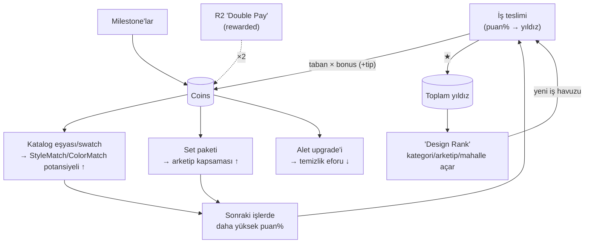

# Ev Ustası — 03 Economy

> Durum: taslak | Versiyon: 0.1 | Tarih: 2026-06-12 | Bağımlı: 02-mechanics.md, 04-content.md, balance/parameters.md

Bu bölüm yalnız **yapıyı** tanımlar: kaynaklar, üreticiler, harcama yerleri ve formül **biçimleri**. Tüm somut sayıların tek doğruluk kaynağı `gdd/home-makeover/balance/parameters.md`'dir (systems-balancer dolduracak); GDD metnine sayı gömülmez. (Lens #46 Economy.)

## 1. Kaynaklar

| Kaynak | Tür | Nasıl kazanılır | Nerede harcanır | Sıfırlanma |
| --- | --- | --- | --- | --- |
| "Coins" | birincil para | iş ödemesi + puan bonusu + "tip", milestone, rewarded (R2) | katalog eşyası/swatch, set paketi, alet upgrade'i | asla (prestige yok) |
| Yıldız (★) | ilerleme puanı (harcanmaz) | iş başına en iyi sonuç (1–3) | — (rank + mahalle kapıları) | asla |
| "Design Rank" | türetilmiş ilerleme | `f(toplam ★)` — ayrı XP yok | — (kategori/arketip/mahalle açar) | asla |
| İş puanı (%) | iş-içi skor (geçici) | M5 bileşenleri (aşağıda) | — (yıldız + ödeme bonusunu belirler) | her iş kendi içinde |

Tasarım niyeti: Coins kısa/orta döngünün motorudur; ★/Rank uzun döngünün tek ilerleme dilidir (iki ayrı sayaçla muhasebe yorgunluğu yaratmıyoruz). İş puanı para değil **enstrümandır** — Taste Meter'da her an okunur (L9).

## 2. İş puanı bileşenleri (M5 formül biçimi)

`puan% = w_c·Cleanliness + w_f·Comfort + w_s·StyleMatch + w_r·ColorMatch + w_q·Quirk + w_h·HiddenWish − w_x·Clutter`

| Bileşen | Kaynak | Davranış biçimi |
| --- | --- | --- |
| Cleanliness | M2 | temizlenen kir oranı; teslim koşulu %100 olduğundan teslimde hep tam — erken metre dolumunun motivasyon katmanı |
| Comfort | M4 | odanın temel eşya listesi (04-content) yerleşik mi; eksikse teslim zaten kapalı, fazlası küçük artı |
| StyleMatch | M5 | sevilen stil etiketli eşya başına artan, **azalan getirili** katkı (tekrar katsayısı); nefret edilen etiket eksi |
| ColorMatch | M3, M5 | duvar/zemin + eşya renk etiketlerinin müşteri rengiyle uyumu |
| Quirk | M5 | tekil koşul (örn. "bookshelf var mı") — ikili + küçük derece bonusu |
| HiddenWish | M5 | keşfedilirse sabit bonus; keşfedilmezse 0 (ceza değil) |
| Clutter | M5 | eşya sayısı yumuşak tavanı aşınca artan ceza; "Minimalist" arketipinde ağırlık yüksek |

Ağırlıklar (w) ve eşikler → `balance/parameters.md`. Bağlayıcı biçim kuralları: eksi bileşenler toplamı artıların ölçeğinden küçük kalır (kötü zevk cezalandırmaz, yönlendirir); puan oda durumundan deterministik hesaplanır (farm yok — M5).

## 3. Üreticiler (gelir kaynakları)

| Üretici | Mekanik | Formül biçimi |
| --- | --- | --- |
| İş ödemesi | M6 | `ödeme = tabanÖdeme(iş) × (1 + bonusEğrisi(puan%))` |
| "Tip" (3 yıldız) | M6 | `tip = tabanÖdeme × tipKatsayısı` — yalnız 3★ tesliminde |
| "Redecorate" tekrarı | M1, M6 | `ödeme × tekrarKısıntısı` (katsayı < 1); yıldız farkı tam sayılır |
| Milestone ödülü | M8, 04-content | `ödül = k × güncel ortalama iş ödemesi` (alım gücü endeksli — enflasyona dayanıklı) |
| Rewarded etkiler | 07-monetization | R2 ödeme ×2; diğerleri para değil erişim/efor etkisi — yeni kaynak türü yaratmaz |

## 4. Harcama yerleri (sink'ler)

| Sink | Mekanik | Formül biçimi |
| --- | --- | --- |
| Katalog eşyası / swatch | M7 | kademe fiyatı: `fiyat(kademe) = tabanFiyat × kademeÇarpanı^kademe`; kademe = rank kuşağı |
| Set paketi | M7 | `setFiyatı = Σ(tekil) × setİndirimi` (indirim < 1) |
| Alet upgrade'i | M7 | seviye başına artan basamak; etkisi efor formülüne çarpan (sürtme bütçesi ÷, yarıçap ×) |

Mahalle/kategori açılışı **para istemez** — yalnız ★/Rank kapısıdır (M8). Gerekçe: para tek eksende (dekor zenginliği + konfor) harcanır; ilerleme kapısının parayla da açılabilmesi "katalogsuz zengin" dengesizliği yaratırdı. Karar dokusu: "bir sonraki işi mi alayım, şu 'Cozy Set'i mi, yoksa 'Big Sponge' mı?" üçgeni (Lens #32 Meaningful Choices, #33 Triangularity: set = puan potansiyeli, alet = konfor/hız, biriktirme = premium hedef).

## 5. Ekonomi akış şeması

Dengeleyici çekirdek: katalog büyüdükçe puan tavanı yükselir ama yeni rank kuşağının müşterileri **yeni etiketler** ister — alım gücü hiçbir zaman "her işte otomatik 3★" üretmez; eşleştirme kararı (hangi eşya bu müşteriye?) her işte taze kalır.

## 6. Balance hedefleri (kesin değer DEĞİL)

systems-balancer simülasyonunun doğrulayacağı hedefler; tutmuyorsa parametre, gerekirse yapı revize edilir:

- İlk sürtme **< 5 sn**, ilk teslim **< 3 dk** (FTUE işi küçük tutulur — 05-ux-ui).
- Her iş, yalnız "Starter Set" ile **3★'a matematiksel olarak ulaşılabilir** (premium = kolaylık/çeşit, zorunluluk değil — M7 softlock kuralı).
- Bir iş ödemesi, oyuncunun rank kuşağındaki 1–2 katalog kalemini almaya yetmeli ("her işten eve bir şey götür" hissi).
- "Redecorate" tekrar kısıntısı para farm'ını kapatırken yıldız avını ölü yatırım yapmamalı.
- Clutter cezası + tekrar katsayısı, "odayı saksıyla doldur" stratejisini her arketipte kârsız kılmalı.
- 3★ oranı: ilk mahallede yüksek (öğrenme + pozitiflik), rank yükseldikçe ilk denemede düşer ama "Redecorate" ile erişilebilir kalır (eğri → `balance/parameters.md`).
- Oturum başına 2–3 iş ritmi: iş süresi 2–4 dk bandında tutulur (oda boyutu/kir sayısı pacing'i).

## Açık sorular

- `bonusEğrisi(puan%)` biçimi (doğrusal mı, yıldız basamaklı mı) — basamaklı, yıldız hedefini netleştirir; doğrusal, her puanı değerli kılar. systems-balancer önerisi bekleniyor.
- Premium (rank-üstü) eşyaların 3★ matematiğine katkısı sınırlandırılmalı mı ("pay-to-skip-taste" algısını önlemek için)? R1 kiralama dengesiyle birlikte değerlendirilecek.
- Milestone ödül endeksi k ve "güncel ortalama iş ödemesi" tanımı simülasyonda test edilecek.
- Coins'in geç oyunda birikip anlamsızlaşmaması için üst kuşak set fiyat eğrisi yeterli mi, kozmetik ek sink (atölye/showroom dekoru?) gerekir mi → design-critic + [KES] adayı.
