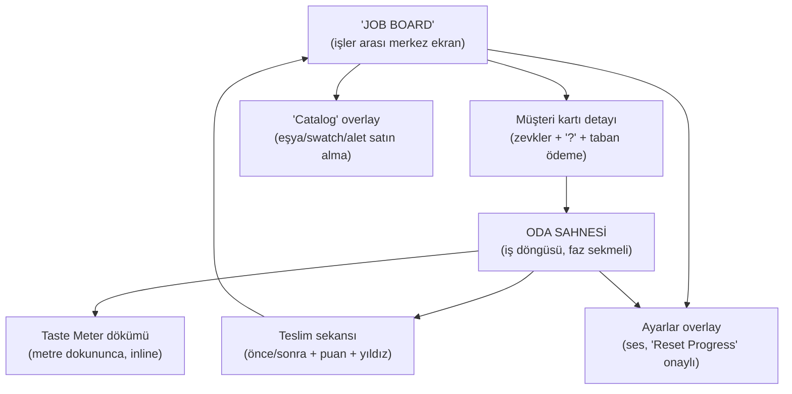

# Ev Ustası — 05 UX / UI

> Durum: taslak | Versiyon: 0.1 | Tarih: 2026-06-12 | Bağımlı: 01-core-loop.md, 02-mechanics.md, 04-content.md

Mobile-first: her öğe önce dik tutulan telefonda dokunma hedefi olarak tasarlanır; masaüstü (fare) uyarlamadır (ders L6). 3D sahne ama **tek oda kadrajı**: serbest kamera yok, oyuncu asla "kamerayla savaşmaz" (Lens #48 Accessibility). Tek parmağın anlamı faz sekmesiyle sabitlenir — bu, 3D'de tek-parmak kontrolün kilit kararıdır.

## 1. Ekran haritası



İlk oturum board'dan değil **doğrudan oda sahnesinden** açılır (FTUE); board ilk teslimden sonra tanıtılır. Aynı anda en fazla bir overlay; dışarı dokunma kapatır.

## 2. Oda sahnesi HUD (dik telefon)

```text
┌─────────────────────────────────┐
│ ● 240 Coins        [⚙]          │ ← üst: coins, ayarlar
│ ♥ TASTE METER ▓▓▓▓▓░░  [Müşteri │ ← imza enstrüman + müşteri kartı pulu
│   kartı pulu: Cozy·Warm·?]      │
│                                 │
│        [ 3D ODA KADRAJI ]       │ ← müşteri kapı eşiğinde
│      (kir / yüzeyler / grid)    │
│                                 │
│              [⟳]                │ ← kamera 90° döndürme butonu
│ ["Clean"]["Paint"]["Furnish"]   │ ← faz sekmeleri
│ [═══ tepsi: eşya/swatch ═══]    │ ← aktif faza göre içerik
│            ["Deliver"]          │ ← koşullar sağlanınca aktif
└─────────────────────────────────┘
```

- **Taste Meter — imza enstrüman (L9):** Kategori renkli segmentli tek bar + yıldız eşik çentikleri. Her puan değişimi, kaynağından metreye uçan etiketle yazılır ("Cozy +12"). Metreye dokunma kategori dökümünü açar. Müşteri kartı pulu (portre + etiket ikonları + "?") metrenin yanında kalıcıdır — eşleştirme dili hep ekranda.
- **Faz sekmeleri:** "Clean" üzerinde kalan kir sayacı rozeti; "Furnish"e geçince tepsi kategori karuseline döner. CLEAN tamamlanmadan diğer sekmeler kilitli değil ama "Deliver" temizlik bitmeden hep pasif (neden pasif olduğu dokununca söylenir — sessiz ret yok).
- HUD'da olmayanlar (bilinçli): süre sayacı / hamle limiti (baskı yok — meditatif iş), bütçe limiti (House Flipper'dan bilinçli sapma, M7), mini-map (tek oda).

## 3. Input şeması

| Girdi | Mobil | Masaüstü | Etki (faza göre) |
| --- | --- | --- | --- |
| Tap / sol tık | dokun | tıkla | çöp topla (Clean), yüzeye uygula (Paint), eşya seç/yerleştir (Furnish), tüm UI |
| Drag / sürükle | tek parmak | sol tık basılı | kir sürtme (Clean), hayalet taşıma (Furnish), önce/sonra kaydırıcı (Delivery) |
| Kamera döndür | ekran butonu [⟳], 90° adım | aynı buton (+ Q/E yok — tek dil) | oda 4 köşe açısından bakılır |
| Pinch / tekerlek | iki parmak (opsiyonel) | scroll | dar aralıkta zoom [KES adayı] |
| Klavye | — | yok | tek girdi dili korunur |

Kurallar:

- Long-press, çift tıklama, sağ tık, iki parmak zorunluluğu **yok** — tek fiil: dokun/sürükle; anlamı aktif faz belirler.
- Serbest orbit kamera yok: 4 sabit köşe açısı (buton ile saat yönünde), sabit eğim. Hayalet sürüklerken kamera kilitli (M4).
- Dokunma hedefleri parmak ölçüsünde; tepsi öğeleri ve sekmeler asla sıkışmaz (somut px tech-architect responsive planında).
- Tap/drag ayrımı kısa mesafe eşiğiyle (yanlış sürtme = yanlış seçim olmamalı; eşik tech-architect).
- PAINT'te yanlış yüzeye uygulama korkusu yok: yeniden boyama bedava (M3) — geri al butonu gerekmez.

## 4. FTUE — ilk 30 saniye (saniye saniye)

Diegetik tutorial: metin duvarı yok (04-content §7). FTUE bayrakları kayda yazılır (M9). FTUE işi: "Cozy Bedroom" × "Grandma Rose", oda **yarısı temizlenmiş** hâlde açılır — görev kendini anlatır (3 sn kuralı).

| Saniye | Ekranda olan | Oyuncu eylemi | Sistem tepkisi |
| --- | --- | --- | --- |
| 0–2 | Menü yok; oda yüklenir: sol yarı pırıl pırıl, sağ yarıda 2 kir lekesi + 1 çöp. "Grandma Rose" kapı eşiğinde el sallar; kartı üstte: "Loves: Cozy · Warm · ?" | izler | tek dikkat odağı: en yakın kir lekesi nabız atan parıltıda + parmak işareti |
| 2–5 | — | parmağını lekede sürter | kir **anında** parmak altında silinir + köpük/parıltı + squeak (ilk ödül ~4–5. sn) |
| 5–9 | ikinci leke parlar | sürter; çöpe dokunur | leke biter: parıltı patlaması; çöp kutuya uçar; temizlik metresi dolar |
| 9–12 | **"Sparkling Clean!"** bandı + oda ışığı ısınır; "Furnish" sekmesi parlar (FTUE'de Paint atlanır) | sekmeye dokunur | tepsi açılır: 3 eşya — yatak vurgulu |
| 12–18 | yatağa dokununca hayalet odada belirir; ipucu: "Drag the bed anywhere you like!" | hayaleti sürükler, bırakır | pop + toz + "thud"; **"Grandma Rose" kalp atar**: "Cozy +20" metreye uçar |
| 18–25 | tepside lamba + halı sırada | 1–2 eşya daha yerleştirir | her birinde tepki + etiketli puan; metre yıldız çentiğini geçer; **"First Smile!"** bandı |
| 25–30 | "Deliver" butonu parlamaya başlar | "Deliver"a dokunur | teslim sekansı başlar: önce/sonra + konfeti + ödeme sayacı — 30. sn bağlanma zirvesi |

Not: FTUE işi bilinçli kısadır (2 leke, 3 eşya); "?" gizli dilek FTUE'de doldurulmaz, teslim ekranında "A hidden wish was left undiscovered…" satırı merak tohumunu eker (Lens #4 Curiosity) — 2. işte oyuncu kartı kendiliğinden okur.

## 5. FTUE — 30 saniye sonrası (kaba akış)

- **~1–2 dk:** Teslim ekranı + ödeme; "Job Board" ilk kez açılır (2 yeni kart). Toast: "Tap her card to see her taste."
- **~2–6 dk:** 2. iş: PAINT fazı tanıtılır ("Tap a swatch, then tap a wall!"); ilk renk eşleşme tepkisi; ilk katalog alımı için yeterli coins birikmiştir (balance hedefi: her işten 1–2 kalem — 03-economy).
- **~6–12 dk:** 3. işte ilk "Hidden Wish" keşfi (havuz, erken işlerde keşfi kolay dilekler içerir — `balance/parameters.md`); "Hidden Wish Found!" milestone'u merak döngüsünü mühürler. İlk rank eşiği yaklaşır.
- İpuçları (≤ 8 benzersiz toast) yalnız ilgili an ilk kez yaşanırken; tekrarlamaz (M9 bayrakları).

## 6. Durum okunabilirliği kuralları

- "Neresi kirli?" anında okunur: kir decal'leri yüksek kontrast + kalan kir sayacı; son kirler yumuşak okla işaret edilir (L12, M2).
- "Nereye koyabilirim?" anında okunur: hayalet yeşil/kırmızı; engel hücreleri geçersiz anda kısa vurgulanır (M4).
- "Neden bu puan?" anında okunur: çıplak sayı yasak — her etiket nedenli ("Cozy +12"); müşteri tepkisi kaynak eşyanın üstünde belirir (L9, M5).
- Kilitli içerik sessiz değildir: kilitli eşya/sekme dokununca koşulunu söyler ("Unlocks at Interior Stylist").
- "Deliver" pasifken dokunma nedenini söyler ("Clean the room first!" / eksik temel eşya adı).
- Sayı biçimi kısaltmalı ("1.2K"); metin her zaman tek satır, ikon + sözcük çifti (okuma yükü minimum).

## Açık sorular

- Dik (portrait) birincil varsayımı 3D oda kadrajıyla test edilmedi: dar kadrajda duvarlar odayı gizler mi? Duvar saydamlaştırma (kameraya bakan duvar otomatik söner) tekniği tech-architect prototipinde doğrulanacak — bu, projenin en erken UX riski.
- Kamera 4 sabit açı yeterli mi, 8 açı (45°) gerekir mi? Az açı = sadelik, çok açı = yerleştirme hassasiyeti — dikey dilim playtest'i.
- Taste Meter üstte mi (bakış hattı) altta mı (başparmak + tepsiyle bütünlük)? Prototipte A/B.
- FTUE'de Paint fazının 2. işe ertelenmesi akışı bölüyor mu, yoksa yükü doğru mu dağıtıyor — playtest.
- Masaüstünde sürtme (fare basılı sürükleme) mobil kadar tatmin ediyor mu; imleç için özel sünger ikonu gerekir mi — juice ayarı (06 ile ortak).
