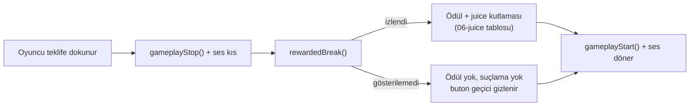

# Ev Ustası — 07 Monetization (Poki)

> Durum: taslak | Versiyon: 0.1 | Tarih: 2026-06-12 | Bağımlı: 02-mechanics.md, 04-content.md, 05-ux-ui.md

İlke: tüm reklamlar **opt-in rewarded**; zorunlu interstitial yok; `commercialBreak` yalnız doğal kırılmada (ev teslimi sonrası). Reklam, oyuncunun zaten istediğini hızlandırır/zenginleştirir — oyun reklamsız da bütünüyle oynanabilir (Lens #96 Profit: gelir modeli deneyime hizmet eder, tersi değil).

## 1. Poki ortam kısıtları (hatırlatma)

Stüdyonun Poki deneyimi henüz yok; kayda geçsin:

- Oyun **iframe** içinde çalışır; dış link, hesap, sosyal yönlendirme yok; harici istek minimum.
- Ödeme yok: tek gelir Poki reklam SDK'sı.
- Adblock/doldurulamama gerçeği: her rewarded teklifin yokluğunda akış bozulmaz (buton gizlenir); hiçbir ilerleme reklama kilitlenemez (M7 softlock kuralı reklamsız da geçerli).
- localStorage tek kalıcılık; hesap senkronu yok.

## 2. Poki SDK çağrı noktaları

| SDK çağrısı | Ne zaman | Ev Ustası'ndaki an |
| --- | --- | --- |
| `gameLoadingFinished()` | yükleme bitti, etkileşime hazır | FTUE odasının ilk karesi çizildiğinde (menü yok; "oynanabilir an" = ilk kare) |
| `gameplayStart()` | aktif oynanış başladı/sürdü | ilk karede; her overlay/reklam dönüşünde; sekme öne gelince |
| `gameplayStop()` | oynanış durdu | reklam öncesi; sekme arka plana gidince; teslim sekansı puan paneli açıkken |
| `rewardedBreak()` | oyuncu rewarded teklife dokundu | aşağıdaki 5 yerleşim; öncesi `gameplayStop()` + ses kıs, dönüşte ödül + `gameplayStart()` |
| `commercialBreak()` | doğal kırılma | **yalnız** teslim puan paneli kapanıp "Job Board"a dönerken (iş bitti, akış doğal kesik); başka hiçbir yerde |

Kurallar: reklam sırasında sahne ve sesler tamamen durur; dönüşte oyuncu bıraktığı ekrana döner; `rewardedBreak` ödül vermeden dönerse oyuncu suçlanmaz — buton sessizce kaybolur, sonra yeniden denenir.

## 3. Rewarded yerleşimleri (5 adet, hepsi opt-in)

| # | An | Teklif (oyun içi metin) | Etki | Sıklık / kural | Mekanik bağ |
| --- | --- | --- | --- | --- | --- |
| R1 | FURNISH tepsisinde kilitli premium eşya/set | "Try Premium Set — this job only" | premium set o işte kiralık kullanılır; teslimde tepsiden düşer | iş başına 1 kiralama | M7 (özlem → deneme → satın alma isteği) |
| R2 | Teslim, ödeme satırı | "Double Pay" | iş ödemesi ×2 | teslim başına 1 | M6 |
| R3 | Müşteri kartındaki "?" yuvası | "Reveal with Ad" | "Hidden Wish" açıklanır (bonus için yine eşyayı yerleştirmek gerekir) | iş başına 1; FTUE işinde gösterilmez | M5 (Lens #4 Curiosity'nin dürüst kısayolu) |
| R4 | CLEAN fazı, büyük/kalabalık odalarda | "Magic Vacuum — clean it all" | kalan kir/çöp tek seferde, gösterişli süpürme animasyonuyla temizlenir | yalnız 2.+ mahalle (büyük odalar) ve faz en az bir kez elle sürtüldükten sonra; iş başına 1 | M2 (tekrar yorgunluğu sübabı) |
| R5 | "Job Board" | "Fresh Clients" | board kartları yenilenir (yeni arketip/oda kombinasyonları) | cooldown'lu (değer → `balance/parameters.md`) | M1 |

Yerleşim tasarım kuralları:

- **Çekirdek tatmin satılmaz:** R4, sürt-sil hazzının (oyunun ilk vaadi) yerine geçemez — küçük odalarda hiç görünmez, büyük odada da ancak oyuncu sürtmeye başladıktan sonra belirir. Kir/oda boyutu hiçbir parametrede "reklam izleme baskısı" hedefiyle ayarlanamaz — balance çalışmasına bağlayıcı not (`balance/parameters.md`).
- **R3 keşfi öldürmemeli:** "Hidden Wish" havuzunun anlamlı bölümü reklamsız keşfedilebilir kalmalı (00-overview başarı ölçütü); R3 ipucu verir, bonusu yine oyuncu kazanır.
- **R1 değer dürüstlüğü:** Kiralanan set teslimde gösterişsizce iade edilir; "elinden alındı" hissi yerine katalogda "Buy" yoluna işaret edilir (dönüşüm baskısız).
- **Görsel hiyerarşi dürüst:** Bedava yol asla gizlenmez/küçültülmez; aynı ekranda en fazla **bir** rewarded teklifi görünür (05-ux-ui kuralıyla hizalı).
- Tüm rewarded ödülleri alım gücü/puan ölçeğiyle endeksli (03-economy) — geç oyunda değersizleşen teklif olmaz.

## 4. Teklif sunum akışı

## 5. Ölçüm

MVP'de takip edilecek (Poki paneli + basit iç sayaçlar): yerleşim başına gösterim/tamamlanma; oturum başına gönüllü izleme (hedef ≥ 1, 00-overview); R3 kullanımı vs reklamsız "Hidden Wish" keşif oranı (keşif döngüsü sağlıklı mı); R1 kiralama → satın alma dönüşümü; `commercialBreak` sonrası oturuma devam oranı. Dış analitik servis eklenmez (Poki kısıtı + gizlilik).

## Açık sorular

- `commercialBreak` her teslim sonrası mı, N teslimde bir mi? Her teslim 2–4 dk'da bir reklam demek — casual için sık olabilir; Poki'nin güncel önerisi + playtest ile karar (gerekirse rewarded-only yayınlanır).
- R4'ün varlığı CLEAN fazının tasarımına "yeterince sıkıcı olsun ki izlensin" basıncı uygular mı? Bağlayıcı not bunu yasaklıyor ama design-critic gate'inde ayrıca sorgulanmalı; gerekirse R4 tamamen kesilir (08 kesilebilirler).
- R5 "Fresh Clients" gerçek bir ihtiyaç mı (board zaten her teslimde tazeleniyor — M1)? Belki yalnız "istediğim arketip gelmedi" anına hitap eder; kullanım verisi düşükse kesilir.
- Poki SDK güncel API ayrıntıları ve rewarded sıklık politikası → tech-architect entegrasyon planı.
